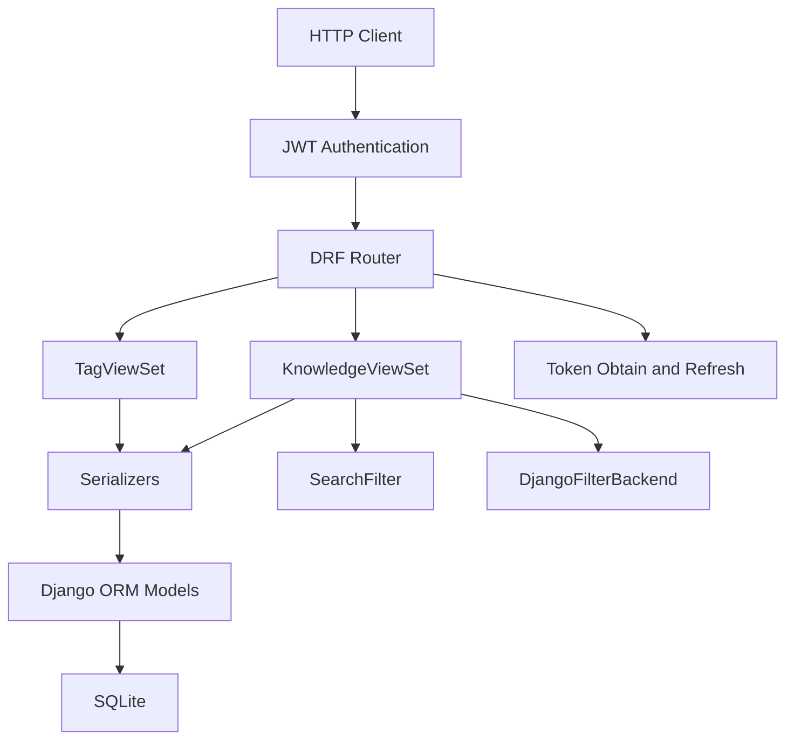
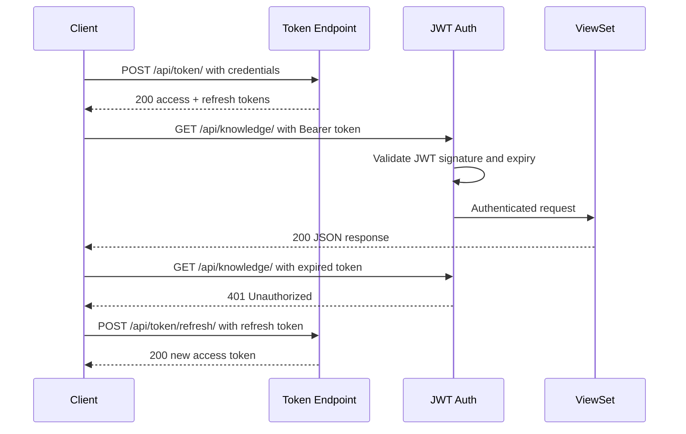
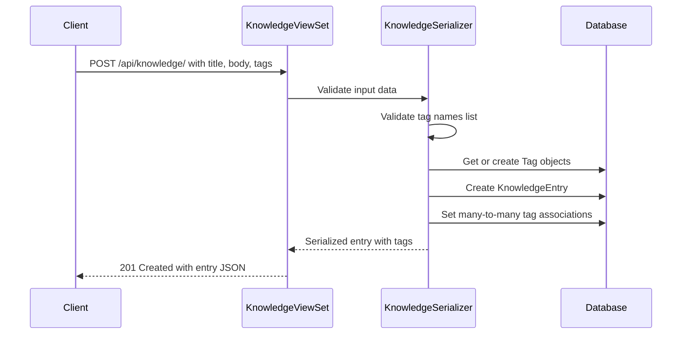
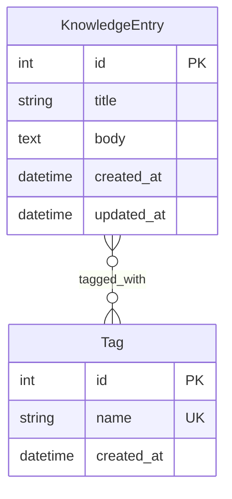

# Design Document: Personal Wiki Knowledge Base

## Overview

**Purpose**: This feature delivers a RESTful API for a personal wiki, enabling a single user to create, organize, and retrieve Markdown-based knowledge entries with tag categorization and keyword search.

**Users**: The wiki owner accesses the API via HTTP clients (e.g., curl, Postman, or a future frontend) to manage personal knowledge.

**Impact**: Introduces the first Django app (`knowledge`) to the project, establishing the foundational data model, authentication scheme, and API patterns for wikinn.

### Goals
- Full CRUD lifecycle for Markdown-based knowledge entries via REST API
- Bearer token (JWT) authentication protecting all data endpoints
- Many-to-many tag system for knowledge categorization
- Keyword search across title and body with optional tag filtering
- Consistent JSON response format with pagination and timestamps

### Non-Goals
- Server-side Markdown rendering or HTML conversion
- User registration or multi-user support
- Role-based access control or permissions beyond single-user auth
- Full-text search engine integration (Elasticsearch, Meilisearch)
- Frontend/UI implementation

## Architecture

### Architecture Pattern & Boundary Map



**Architecture Integration**:
- **Selected pattern**: Standard Django MVT extended with DRF viewsets — single `knowledge` app containing all wiki domain logic
- **Domain boundaries**: All wiki functionality (knowledge entries, tags, search) contained in one app; authentication delegated to `djangorestframework-simplejwt`
- **Existing patterns preserved**: `config/` as project configuration root, top-level app directory per steering conventions
- **New components rationale**: `knowledge/` app is the first domain app; contains models, serializers, views, urls, and tests as a self-contained module
- **Steering compliance**: Follows snake_case naming, kebab-case URL paths, import organization conventions

### Technology Stack

| Layer | Choice / Version | Role in Feature | Notes |
|-------|------------------|-----------------|-------|
| Backend | Django 6.0 + DRF 3.16 | Web framework, ORM, REST API | Already installed |
| Authentication | djangorestframework-simplejwt | JWT bearer token auth | New dependency; native `Bearer` header |
| Filtering | django-filter | Tag-based filtering on list endpoints | New dependency |
| Search | DRF SearchFilter | Keyword search across model fields | Built-in DRF; no extra dependency |
| Data / Storage | SQLite | Development database | Already configured |

> See `research.md` Decision sections for rationale on simplejwt over DRF TokenAuthentication and SearchFilter over custom search.

## System Flows

### Authentication Flow



### Knowledge Entry Create with Tags



## Requirements Traceability

| Requirement | Summary | Components | Interfaces | Flows |
|-------------|---------|------------|------------|-------|
| 1.1 | Create knowledge entry | KnowledgeViewSet, KnowledgeSerializer, KnowledgeEntry | POST /api/knowledge/ | Create with Tags |
| 1.2 | List entries paginated | KnowledgeViewSet, KnowledgeEntry | GET /api/knowledge/ | — |
| 1.3 | Retrieve single entry | KnowledgeViewSet, KnowledgeSerializer | GET /api/knowledge/{id}/ | — |
| 1.4 | Update entry | KnowledgeViewSet, KnowledgeSerializer | PUT/PATCH /api/knowledge/{id}/ | — |
| 1.5 | Delete entry | KnowledgeViewSet | DELETE /api/knowledge/{id}/ | — |
| 1.6 | 404 for missing entry | KnowledgeViewSet | All detail endpoints | — |
| 1.7 | Store raw Markdown | KnowledgeEntry model (TextField) | — | — |
| 2.1 | Accept Markdown text | KnowledgeSerializer | POST/PUT/PATCH | — |
| 2.2 | Return raw Markdown | KnowledgeSerializer | GET responses | — |
| 2.3 | No max length restriction | KnowledgeEntry.body (TextField) | — | — |
| 3.1 | Require bearer token | JWTAuthentication (global) | Authorization header | Auth Flow |
| 3.2 | 401 without auth header | JWTAuthentication | — | Auth Flow |
| 3.3 | 401 with invalid token | JWTAuthentication | — | Auth Flow |
| 3.4 | Token obtain endpoint | TokenObtainPairView | POST /api/token/ | Auth Flow |
| 3.5 | No auth for token endpoint | URL configuration | POST /api/token/ | Auth Flow |
| 4.1 | Accept tags on create/update | KnowledgeSerializer | POST/PUT/PATCH | Create with Tags |
| 4.2 | Auto-create new tags | KnowledgeSerializer.create/update | — | Create with Tags |
| 4.3 | List all tags | TagViewSet | GET /api/tags/ | — |
| 4.4 | Multiple tags per entry | KnowledgeEntry.tags (M2M) | — | — |
| 4.5 | Tag shared across entries | Tag model (M2M) | — | — |
| 4.6 | Include tags in response | KnowledgeSerializer | GET responses | — |
| 5.1 | Search by keywords | SearchFilter on KnowledgeViewSet | GET /api/knowledge/?search= | — |
| 5.2 | Case-insensitive search | SearchFilter (icontains default) | — | — |
| 5.3 | Empty results on no match | SearchFilter | GET /api/knowledge/?search= | — |
| 5.4 | Order by updated_at | KnowledgeViewSet.ordering | — | — |
| 5.5 | Combined search + tag filter | SearchFilter + DjangoFilterBackend | GET /api/knowledge/?search=&tags= | — |
| 6.1 | JSON responses | DRF JSONRenderer (default) | All endpoints | — |
| 6.2 | Timestamps on entries | KnowledgeEntry model, KnowledgeSerializer | All entry responses | — |
| 6.3 | Pagination | PageNumberPagination | List endpoints | — |
| 6.4 | 400 with field errors | KnowledgeSerializer validation | POST/PUT/PATCH | — |

## Components and Interfaces

| Component | Domain/Layer | Intent | Req Coverage | Key Dependencies | Contracts |
|-----------|-------------|--------|--------------|------------------|-----------|
| KnowledgeEntry | Data | Knowledge entry ORM model | 1.1-1.7, 2.1-2.3 | Django ORM (P0) | State |
| Tag | Data | Tag ORM model | 4.1-4.6 | Django ORM (P0) | State |
| KnowledgeSerializer | Serialization | Entry validation and serialization with nested tags | 1.1-1.6, 2.1-2.2, 4.1-4.2, 4.6, 6.2, 6.4 | KnowledgeEntry (P0), Tag (P0) | Service |
| TagSerializer | Serialization | Tag validation and serialization | 4.3 | Tag (P0) | Service |
| KnowledgeViewSet | API | CRUD, search, and filter endpoint logic | 1.1-1.6, 5.1-5.5, 6.1, 6.3 | KnowledgeSerializer (P0), SearchFilter (P1), DjangoFilterBackend (P1) | API |
| TagViewSet | API | Tag list endpoint | 4.3 | TagSerializer (P0) | API |
| JWT Auth Config | Auth | Global authentication setup | 3.1-3.5 | djangorestframework-simplejwt (P0) | API |

### Data Layer

#### KnowledgeEntry Model

| Field | Detail |
|-------|--------|
| Intent | Persists knowledge entry data with Markdown body and tag associations |
| Requirements | 1.1-1.7, 2.1-2.3, 6.2 |

**Responsibilities & Constraints**
- Stores title, Markdown body, and timestamp metadata
- Owns the many-to-many relationship to Tag
- Ordered by `-updated_at` by default

**Contracts**: State [x]

##### State Management
- State model:

```python
class KnowledgeEntry(models.Model):
    title: str          # CharField, max_length=255
    body: str           # TextField, no max_length (raw Markdown)
    tags: QuerySet[Tag] # ManyToManyField to Tag, blank=True
    created_at: datetime # DateTimeField, auto_now_add=True
    updated_at: datetime # DateTimeField, auto_now=True

    class Meta:
        ordering = ["-updated_at"]
```

- Persistence: Django ORM with SQLite backend
- Concurrency: Single-user; no concurrent write handling needed

#### Tag Model

| Field | Detail |
|-------|--------|
| Intent | Represents a unique tag label for categorizing knowledge entries |
| Requirements | 4.1-4.6 |

**Responsibilities & Constraints**
- Unique tag name (case-insensitive uniqueness not enforced at DB level; handled in serializer)
- Referenced by KnowledgeEntry via many-to-many

**Contracts**: State [x]

##### State Management
```python
class Tag(models.Model):
    name: str            # CharField, max_length=100, unique=True
    created_at: datetime # DateTimeField, auto_now_add=True
```

### Serialization Layer

#### KnowledgeSerializer

| Field | Detail |
|-------|--------|
| Intent | Validates and transforms KnowledgeEntry data between API and ORM |
| Requirements | 1.1-1.6, 2.1-2.2, 4.1-4.2, 4.6, 6.2, 6.4 |

**Responsibilities & Constraints**
- Accepts `tags` as a list of tag name strings on write operations
- Returns nested tag data on read operations
- Handles get-or-create logic for tags during create/update
- Returns field-level validation errors as 400 response

**Dependencies**
- Inbound: KnowledgeViewSet — serialization/deserialization (P0)
- Outbound: KnowledgeEntry model, Tag model — data persistence (P0)

**Contracts**: Service [x]

##### Service Interface
```python
class KnowledgeSerializer(serializers.ModelSerializer):
    tags: list[str]  # Write: list of tag names; Read: list of tag representations

    def create(self, validated_data: dict) -> KnowledgeEntry: ...
    def update(self, instance: KnowledgeEntry, validated_data: dict) -> KnowledgeEntry: ...
```
- Preconditions: `title` is required and non-empty; `body` is required
- Postconditions: Tags are get-or-created and associated; entry is persisted
- Invariants: `tags` field accepts strings on write, returns tag objects on read

#### TagSerializer

| Field | Detail |
|-------|--------|
| Intent | Serializes Tag model for list endpoint |
| Requirements | 4.3 |

**Contracts**: Service [x]

##### Service Interface
```python
class TagSerializer(serializers.ModelSerializer):
    class Meta:
        model = Tag
        fields = ["id", "name", "created_at"]
```

### API Layer

#### KnowledgeViewSet

| Field | Detail |
|-------|--------|
| Intent | Exposes CRUD, search, and filter endpoints for knowledge entries |
| Requirements | 1.1-1.6, 5.1-5.5, 6.1, 6.3 |

**Responsibilities & Constraints**
- ModelViewSet providing list, create, retrieve, update, partial_update, destroy actions
- Integrates SearchFilter for keyword search and DjangoFilterBackend for tag filtering
- Uses PageNumberPagination for list responses

**Dependencies**
- Inbound: DRF Router — URL routing (P0)
- Outbound: KnowledgeSerializer — data transformation (P0)
- External: DRF SearchFilter — keyword search (P1)
- External: django-filter DjangoFilterBackend — tag filtering (P1)

**Contracts**: API [x]

##### API Contract

| Method | Endpoint | Request | Response | Errors |
|--------|----------|---------|----------|--------|
| GET | /api/knowledge/ | ?search=&tags=&page= | Paginated list of entries | 401 |
| POST | /api/knowledge/ | `{title, body, tags}` | Created entry | 400, 401 |
| GET | /api/knowledge/{id}/ | — | Single entry | 401, 404 |
| PUT | /api/knowledge/{id}/ | `{title, body, tags}` | Updated entry | 400, 401, 404 |
| PATCH | /api/knowledge/{id}/ | Partial fields | Updated entry | 400, 401, 404 |
| DELETE | /api/knowledge/{id}/ | — | 204 No Content | 401, 404 |

**Implementation Notes**
- `search_fields = ["title", "body"]` for SearchFilter
- `filterset_fields = ["tags__name"]` for DjangoFilterBackend
- Default ordering: `-updated_at`

#### TagViewSet

| Field | Detail |
|-------|--------|
| Intent | Read-only endpoint for listing all tags |
| Requirements | 4.3 |

**Contracts**: API [x]

##### API Contract

| Method | Endpoint | Request | Response | Errors |
|--------|----------|---------|----------|--------|
| GET | /api/tags/ | — | List of all tags | 401 |

#### JWT Authentication Endpoints

| Field | Detail |
|-------|--------|
| Intent | Token obtain and refresh endpoints (provided by simplejwt) |
| Requirements | 3.1-3.5 |

**Contracts**: API [x]

##### API Contract

| Method | Endpoint | Request | Response | Errors |
|--------|----------|---------|----------|--------|
| POST | /api/token/ | `{username, password}` | `{access, refresh}` | 401 |
| POST | /api/token/refresh/ | `{refresh}` | `{access}` | 401 |

**Implementation Notes**
- These endpoints are exempt from JWT authentication (3.5)
- Provided directly by `rest_framework_simplejwt.views.TokenObtainPairView` and `TokenRefreshView`

## Data Models

### Domain Model



- **Aggregate root**: KnowledgeEntry — owns lifecycle of its tag associations
- **Entity**: Tag — shared across entries, unique by name
- **Invariants**: Tag names are unique; KnowledgeEntry requires title and body

### Physical Data Model

**knowledge_knowledgeentry**

| Column | Type | Constraints |
|--------|------|-------------|
| id | INTEGER | PK, auto-increment |
| title | VARCHAR(255) | NOT NULL |
| body | TEXT | NOT NULL |
| created_at | DATETIME | NOT NULL, auto |
| updated_at | DATETIME | NOT NULL, auto |

**knowledge_tag**

| Column | Type | Constraints |
|--------|------|-------------|
| id | INTEGER | PK, auto-increment |
| name | VARCHAR(100) | NOT NULL, UNIQUE |
| created_at | DATETIME | NOT NULL, auto |

**knowledge_knowledgeentry_tags** (Django auto-generated join table)

| Column | Type | Constraints |
|--------|------|-------------|
| id | INTEGER | PK, auto-increment |
| knowledgeentry_id | INTEGER | FK → knowledge_knowledgeentry |
| tag_id | INTEGER | FK → knowledge_tag |

Index: UNIQUE(knowledgeentry_id, tag_id)

### Data Contracts & Integration

**Knowledge Entry Response Schema**:
```json
{
  "id": 1,
  "title": "Getting Started with Django",
  "body": "# Django\n\nMarkdown content here...",
  "tags": [
    {"id": 1, "name": "django", "created_at": "2026-02-11T00:00:00Z"}
  ],
  "created_at": "2026-02-11T00:00:00Z",
  "updated_at": "2026-02-11T00:00:00Z"
}
```

**Knowledge Entry Request Schema**:
```json
{
  "title": "Getting Started with Django",
  "body": "# Django\n\nMarkdown content here...",
  "tags": ["django", "python", "tutorial"]
}
```

**Paginated List Response Schema**:
```json
{
  "count": 42,
  "next": "http://localhost:8000/api/knowledge/?page=2",
  "previous": null,
  "results": [...]
}
```

## Error Handling

### Error Strategy
DRF's built-in exception handling provides consistent JSON error responses. Custom handling is minimal — rely on framework defaults.

### Error Categories and Responses

**User Errors (4xx)**:
- 400 Bad Request: Field-level validation errors returned as `{"field_name": ["error message"]}` (DRF default)
- 401 Unauthorized: Missing or invalid JWT token — `{"detail": "Authentication credentials were not provided."}` or `{"detail": "Given token not valid for any token type"}`
- 404 Not Found: Entry does not exist — `{"detail": "Not found."}`

**System Errors (5xx)**:
- 500 Internal Server Error: Unhandled exceptions — DRF default handler returns JSON in API context

### Monitoring
- Django's built-in logging for error tracking
- DRF exception handler logs validation failures at WARNING level

## Testing Strategy

### Unit Tests
- KnowledgeEntry model: creation, timestamp auto-population, tag association
- KnowledgeSerializer: validation (missing title/body), tag get-or-create, nested tag output
- TagSerializer: serialization output format

### Integration Tests
- KnowledgeViewSet CRUD: full lifecycle (create → read → update → delete) via API client
- Authentication enforcement: 401 for unauthenticated requests, 200 for authenticated
- Search: keyword matches across title and body, case-insensitivity, empty results
- Tag filtering: filter by tag name, combined search + tag filter
- Pagination: verify paginated response structure and navigation

### E2E Tests
- Token obtain → create entry with tags → search by keyword → filter by tag → update → delete
- Token refresh flow: obtain → expire → refresh → re-access

## Security Considerations

- JWT tokens signed with Django `SECRET_KEY` using HS256; production deployments must use a strong, unique secret
- Token lifetimes should be configured appropriately (default 5min access / 1day refresh; consider longer access for personal use convenience)
- All data endpoints require authentication; only `/api/token/` and `/api/token/refresh/` are public
- Input validation via DRF serializers prevents injection through API fields
- CSRF protection not required for JWT-authenticated API endpoints (DRF disables CSRF for token auth)
