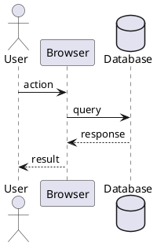

# PlantUML Practices

Examples of creating sequence diagrams using PlantUML syntax.

## Technologies

- **PlantUML** - Text-based diagram generation tool

## Key Practices

### Basic Sequence Diagram Structure


### Participant Types

| Type | Syntax | Use Case |
|------|--------|----------|
| `actor` | `actor User` | End users |
| `participant` | `participant "Name" as N` | Generic components |
| `database` | `database "DB" as DB` | Data stores |
| `collections` | `collections "Config" as C` | Config stores |
| `entity` | `entity "Entity" as E` | Domain entities |

### Grouping with Boxes
```plantuml
box "Client"
participant "Browser" as B
end box

box "Server"
participant "Rest Server" as RS
database "Database" as DB
end box
```

### Section Dividers
```plantuml
== User Accesses the Application ==
User -> B : access URL

== Server Processes Request ==
B -> RS : API call
```

### Control Flow

#### Loop
```plantuml
loop rows
    RS -> DB : SELECT query
    DB --> RS : result
end loop
```

#### Conditional (alt/else)
```plantuml
alt error
    RS -> B : 500 Error
else success
    RS -> B : 200 OK
end else
```

#### Optional (opt)
```plantuml
opt error handling
    RS -> B : 500 Internal Server Error
end opt
```

#### Group
```plantuml
group Access Entity
    RS -> E : GET request
    E --> RS : response
end group
```

### Notes
```plantuml
note right of B #FFAAAA
    |= col1 |= col2 |
    | val1  | val2  |
end note

note left of B #11FFAA
    Error message here
end note
```

### Arrow Types

| Arrow | Meaning |
|-------|---------|
| `->` | Solid line, solid arrowhead (request) |
| `-->` | Dotted line, solid arrowhead (response) |
| `->>` | Solid line, open arrowhead |
| `-->>` | Dotted line, open arrowhead |

## Tips

- Use aliases (`as B`) for long participant names
- Color notes with `#RRGGBB` hex codes
- Tables in notes use `|= header |` for headers and `| cell |` for cells
- Group related interactions with `group`, `box`, or section dividers
- Use `alt`/`else` for branching logic, `opt` for optional flows
- Use `loop` for repeated operations

## Setup

```bash
# Install PlantUML (macOS)
brew install plantuml

# Generate diagram
plantuml sequence.plantuml

# Or use online: https://www.plantuml.com/plantuml
```

## VS Code Extension

Install "PlantUML" extension for:
- Live preview
- Syntax highlighting
- Export to PNG/SVG
